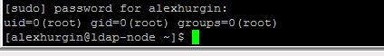

# ldap task3
***Student***: [Aliaksei Khurhin](https://epa.ms/1Cqi0K)

1. Screenshot of user first time login into the system (with password):

2. Screenshot of user login into the system (with ssh keys):

3. Screenshot of user groups details: 

4. Screenshot of execution any command as root via sudo:

