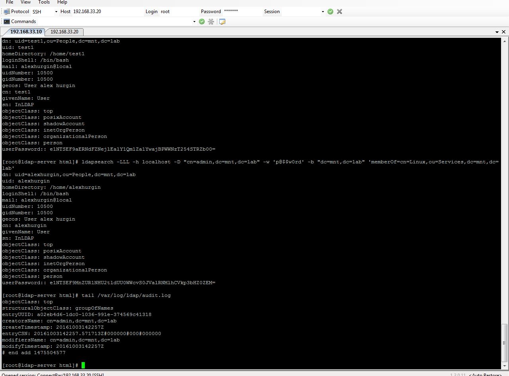
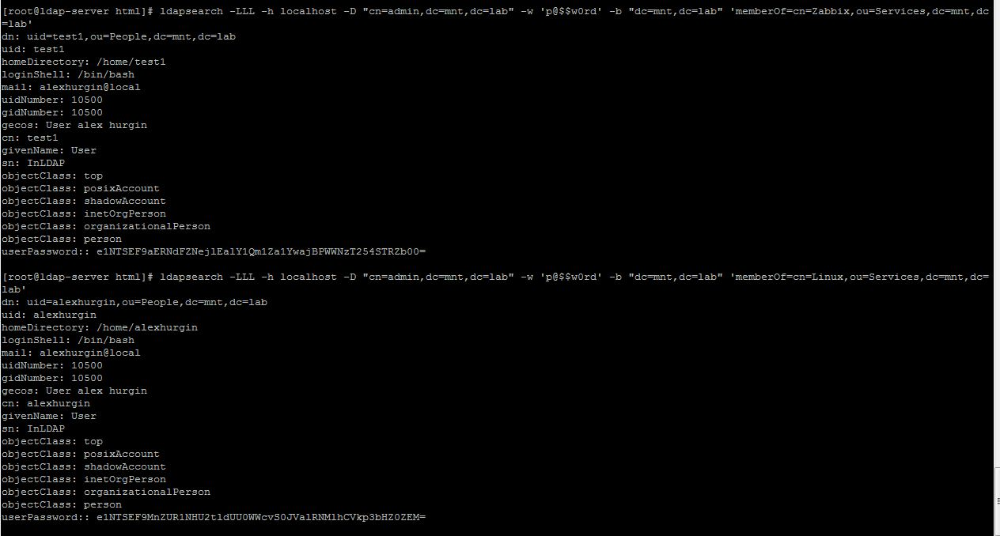
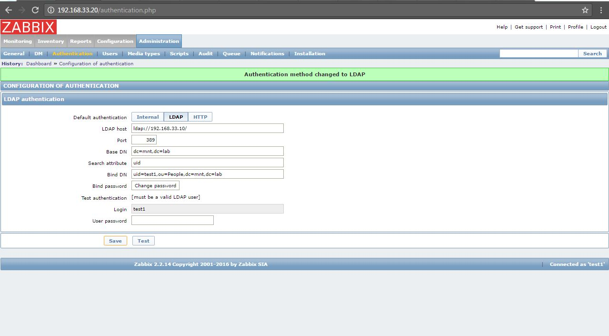
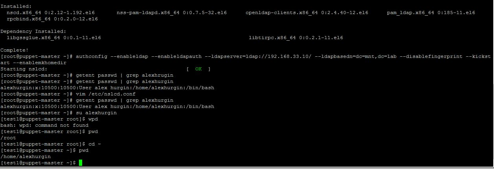
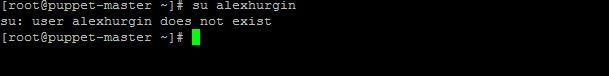

# ldap task2
***Student***: [Aliaksei Khurhin](https://epa.ms/1Cqi0K)

1. Screenshot of audit.log file content (changes in your LDAP):

2. Screenshot of output ldapsearch commands: users belonged to Linux group and users belonged to Zabbix group:

3. Succesfull Zabbix LDAP authentication implementation: 

4. OpenLDAP client installation and LDAP user applying:

5. Attempting to login as LDAP user after removing it from Linux group:

