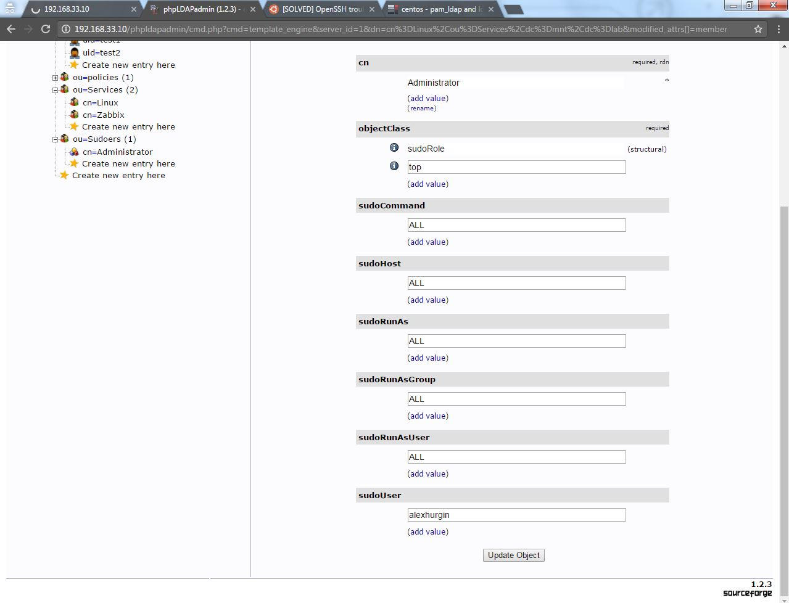

# ldap task1
***Student***: [Aliaksei Khurhin](https://epa.ms/1Cqi0K)

1. 1.	Screenshot of slapd running process:

2. 2.	Screenshot of successfully executed commands:

User, that was created from the GUI: 

3. 3.	Screenshot of phpLDAPadmin:

Provision with puppet will be implemented in a day (puppet module and vagrantfile)

